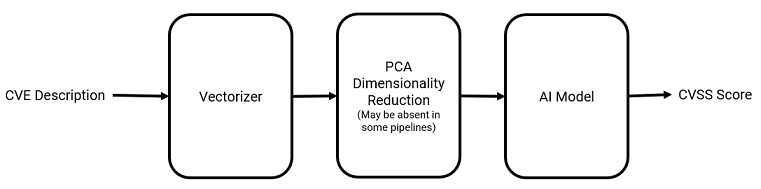

# Overview

This writeup details the construction of rudimentary machine learning models that use the descriptions of CVEs to predict their corresponding base CVSS scores. 
A brief illustration is shown below.



The original idea originates from an internship that I have done, and this personal project is an attempt on my own to improve and expand on what I done previously. 
The project is still a work in progress.

Python and its associated libraries (mainly Pandas, Sklearn and some SpaCy) are used.

# Raw Data Gathering and Filtering

Data for this project is taken from [CVE JSON data feeds](https://nvd.nist.gov/vuln/data-feeds#) provided by the National Vulnerability Database (NVD). 
Each data feed contains details of CVEs in a particular year, with the earliest data feed coming from the year 2002. 
The JSON data feeds contain tons of data about each CVE, such as the CWEs associated with it, references, descriptions, CVSS V2 and V3 metrics, and published dates.

As the JSON data feeds are quite complex, they cannot be easily parsed into a dataframe using Pandas and Python's json library due to their extremely nested structure and missing fields when data is absent. 
Thus, I decided to just extract the essential data (CVE description, base CVSS V2 score, and base CVSS V3 score) that will be needed from the data feeds instead of trying to parse all data into a nice dataframe. 
Since not every CVE has an associated CVSS V2 or V3 score, missing scores are temporarily replaced with a `None` when extracting these data. 
The function used is shown here:
```
def get_useful_features(raw_cve_entry):
    entry = dict()
    try:
        entry["description"] = raw_cve_entry["cve"]["description"]["description_data"][0]["value"]
    except KeyError:
        entry["description"] = None
    try:
        entry["baseScoreV3"] = raw_cve_entry["impact"]["baseMetricV3"]["cvssV3"]["baseScore"]
    except KeyError:
        entry["baseScoreV3"] = None
    try:
        entry["baseScoreV2"] = raw_cve_entry["impact"]["baseMetricV2"]["cvssV2"]["baseScore"]
    except KeyError:
        entry["baseScoreV2"] = None
    return entry
```

The extracted essential data can be seen below.


After extracting the data, a quick look at the data will show that there are many unusable CVEs that are included in the data (See row 177474 in the figure above). 
The different reasons for the CVEs to be usuable is shown below, along with the number of CVEs that is tagged with that reason.

|Reason for not being used|Number of CVEs|
|:---|:---|
|REJECT|10349|
|DISPUTED|897|
|UNSUPPORTED WHEN ASSIGNED|91|
|PRODUCT NOT SUPPORTED WHEN ASSIGNED|6|
|UNVERIFIABLE|5|
|UNVERIFIABLE, PRERELEASE|2|
|SPLIT|1|

Since they all had a description that starts with `** <REASON> **`, a quick regex matching was done to filter out and remove these unneeded data.
```
df = df[~(df.description.str.contains('^\\*\\*\\s+[A-Z]+\\s+\\*\\*\\s+'))]  # Remove unneeded CVEs
```


Initially, I thought of using both base CVSS V2 and V3 scores in the project, simply to see which score can be better predicted. 
However, after looking at the counts of each metric, I realised that the number of CVEs with base CVSS V2 scores (165904) vastly outnumbered the number of CVEs with base CVSS V3 scores (92983). 
As such, I then decided to remove all CVEs that do not have a base CVSS V2 score and just focus on predicting base CVSS V2 scores, simply as that would allow me more data to work with.
```
df.dropna(inplace=True, subset=["baseScoreV2"])
```

After the removal of unusable CVEs and CVEs that do not have an associated base CVSS V2 score, I was left with a total of 165904 rows of CVE entries, shown below.


The CVE entries are then split into train and test data.
```
X = df["description"]
y = df["baseScoreV2"]

X_train, X_test, y_train, y_test = train_test_split(X, y, test_size=0.3)
```

The distribution of base CVSS V2 scores of the training data is shown below.


# ML Pipeline Construction

Since I have filtered out all unneedded data, I can proceed to create the ML pipelines.
The pipelines will consists of 3 steps:

1. Vectorizer to convert CVE descriptions into a vector form suitable to be fed into ML algorithms.
2. An optional PCA algorithm to reduce the dimensions of the input from the vectorizer.
3. The actual ML model that will be used.

## NLP Processing and Vectorizing

Firstly, I chose the easy way out and used the Bag-of-Words (BoW) and TF-IDF models to vectorize the descriptions. These 2 models can be invoked by simply using Sklearn's CountVectorizer and TfidfVectorizer. 
To augment these vectorizers, I used SpaCy to write a custom tokenizer function to do basic NLP processing on these descriptions which can be fed into Sklearn's vectorizers. 
The Python library SpaCy is used for this purpose since it contains pretrained NLP pipelines which simplifies this processing step immensely.
```
# Create custom tokenizer
def tokenizer(desc):
    tokens = nlp(desc)
    tokens = [word.lemma_.lower().strip() for word in tokens]
    tokens = [word for word in tokens if word not in nlp.Defaults.stop_words and not set(word).issubset(punctuation)]
    return tokens
```

The function first feed each description into SpaCy's *en_core_web_lg* pretrained pipeline, where they are tokenized. 
Then, each token is stripped off leading and trailing whitespaces, before being converted to lowercase and lemmatized. 
If the token is a punctuation or a stop word, it is removed too. 
The result is then a list of tokens that will be used by Sklearn's vectorizers to fit the BoW and TF-IDF models. 
The output of the vectorizers will then be a word vector that represents the CVE description that was fed in.

The vectorizers and parameters used are shown below:
```
CountVectorizer(tokenizer=tokenizer,
                ngram_range=(1,2),
                max_df=0.5,
                min_df=5,
                max_features=10000,)

TfidfVectorizer(tokenizer=tokenizer,
                ngram_range=(1,2),
                max_df=0.5,
                min_df=5,
                max_features=10000,)
```

## PCA for Dimensionality Reduction

As the dimensions of the word vectors are very large due to the large vocabulary accumulated from all the training CVE descriptions, PCA is used reduce the number of dimensions of the word vectors. 
However, as including this step increases the computational time by a lot, this step is ommitted in most of the pipelines that I created.
```
TruncatedSVD(n_components=10000, n_iter=7, random_state=42)
```

## Choosing ML Models

Since my aim is just to explore which ML model will give a better result, I chose a few simple models to get a basic feel of how well a model can predict the base CVSS V2 scores using their associated CVE descriptions (The models were also chosen with considerations for my potato laptop).

Models chosen were:
* Linear Regression
* KNN
* Decision Trees
* Gradient Boosting Regression (Xgboost)

With the exception of Linear Regression which was fitted on transformed features from both BoW and TF-IDF vectorizers, the other 3 models were only fitted on transformed data from the TF-IDF vectorizer. 

```
linear_regr = LinearRegression()

knn_regr = KNeighborsRegressor()

dt_regr = DecisionTreeRegressor(min_samples_split=5, min_samples_leaf=3,)

xgboost_regr = GradientBoostingRegressor()
```

# Results

To score results of the models, Mean Square Error was chosen as the evaluation metric, since I want to penalized models more for larger errors. 
As the target base CVSS V2 score only ranges from 0 to 10, the predicted values of the models are further fed into a function that constrains the predicted values to this range (predicted values that are less than 0 to 0, and all predicted values more than 10 to 10). 
```
y_pred = np.clip(pipeline.predict(X_test), 0, 10)
mse = mean_squared_error(y_test, y_pred)
```

Results are shown in the table below. Do note fine tuning of models have not been done as of the writing of this writeup since it is probably going to take a long time to run and burn up my laptop.

|Model|Vectorizer|Have PCA|MSE|
|:---|:---|:---|:---|
|Linear Regression|BoW|False|1.62|
|Linear Regression|TF-IDF|False|1.66|
|Linear Regression|BoW|True|1.59|
|KNN|TF-IDF|False|1.92|
|Decision Trees|TF-IDF|False|2.22|
|Xgboost|TF-IDF|False|1.91|

# Discussion and Future Work

As can be seen, the BoW vectorizer seem to produce slightly better results than the TF-IDF vectorizer. 
Inclusion of the PCA algorithm also provides some slight improvements. 
Comparing the different models used, linear regression seem to have produced the best results.

Overall, the best MSE of 1.59 is a good sign, especially since the pipelines are not optimised at all.
This shows that the ML model will on average have an error of about 1.59 when prediciting CVSS scores, which is still acceptable since 1.59 is not too much over the range of 0 to 10.

In the future, work will be done in the following aspects:
1. Constructing a recurrent neural network to compare against the performance of these classic ML algorithms.
2. Perform more pre-processing on the CVSS scores, since they are not very normally distributed.
3. Incorporate word vectors and compare performance against the BoW and TF-IDF vectorizers.
4. Optimising hyperparameters to get an optimal model.
5. Employing the model for various use cases.

# References

* https://nvd.nist.gov/vuln/data-feeds#
* https://scikit-learn.org/stable/modules/classes.html
* https://pandas.pydata.org/docs/
* https://spacy.io/usage/linguistic-features
* https://www.kaggle.com/nkitgupta/text-representations
* https://www.kaggle.com/abhishek/approaching-almost-any-nlp-problem-on-kaggle
* https://www.ibm.com/support/pages/transforming-variable-normality-parametric-statistics
* https://towardsdatascience.com/working-with-sparse-data-sets-in-pandas-and-sklearn-d26c1cfbe067
